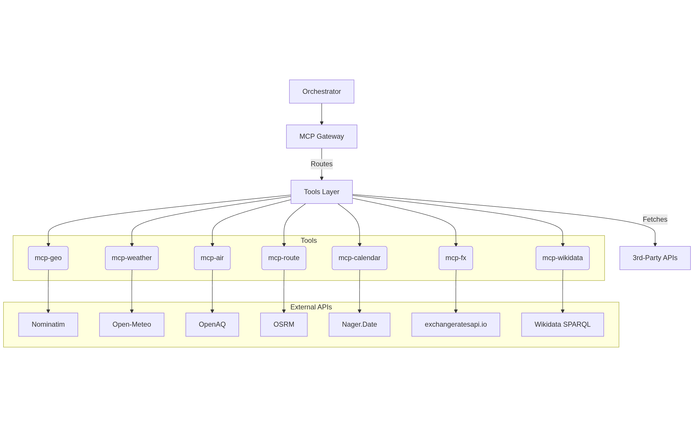
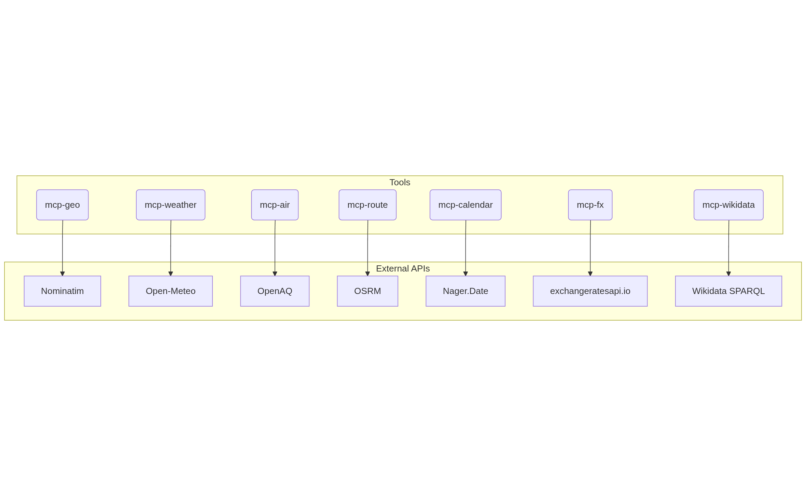

# MCP API Server (City Day Navigator)

This is the backend API server for the City Day Navigator. It provides a set of secure, rate limited, and logged micro tools that abstract complex third party APIs into a simple, unified interface.

This server provides the "tools" (e.g., `geocode`, `forecast`, `eta`) that the Orchestrator uses to gather data.

---

## Architecture Diagram

This diagram shows how the MCP server acts as a secure gateway to all external APIs.




---

## 🛠️ API Endpoints

All endpoints are protected by an X-API-KEY header and a 30 req/min rate limit.

### mcp-geo

**GET /mcp/geo/geocode**
- Query Params: `city={name}`
- Returns: `{"lat": 35.01, "lon": 135.76, "display_name": "..."}`

**GET /mcp/geo/nearby**
- Query Params: `lat={lat}&lon={lon}&query={query}&radius_m=5000&limit=15`
- Returns: `{"places": [{"name": "Kinkaku-ji", ...}]}`

### mcp-weather

**GET /mcp/weather/forecast**
- Query Params: `lat={lat}&lon={lon}&date={YYYY-MM-DD}`
- Returns: `{"temp_c": 11.2, "precip_prob": 3, ...}`

### mcp-air

**GET /mcp/air/aqi**
- Query Params: `lat={lat}&lon={lon}`
- Returns: `{"pm25": 10.5, "category": "Good", ...}`

### mcp-route

**POST /mcp/route/eta**
- Body: `{"profile": "car", "points": [{"lat": ..., "lon": ...}, ...]}`
- Returns: `{"distance_km": 10.5, "duration_min": 25.1, ...}`

### mcp-calendar

**GET /mcp/calendar/holidays**
- Query Params: `country_code={CC}&year={YYYY}`
- Returns: `[{"date": "2025-01-01", "localName": "元日"}, ...]`

### mcp-fx

**GET /mcp/fx/convert**
- Query Params: `amount={num}&from={CUR}&to={CUR}`
- Returns: `{"rate": 148.5, "converted": 29700}`

### mcp-wikidata

**POST /mcp/wikidata/query**
- Body: `{"query": "SELECT ..."}`
- Returns: `{"results": {"bindings": [...]}}`

---

## 🚀 Setup & Run

1. **Clone the repo:**
   ```bash
   git clone https://github.com/ayushh2k/city-nav-mcp.git
   cd city-nav-mcp
   ```

2. **Install dependencies:**
   ```bash
   go mod tidy
   make install-air
   ```

3. **Create `.env` file:**
   ```
   OPENAQ_API_KEY="your_openaq_key"
   EXCHANGERATE_API_KEY="your_exchangeratesapi_key"
   ```

4. **Run the dev server:**
   ```bash
   make dev
   ```
   The server will run on `http://localhost:8000`.

---

## 🐳 Running with Docker


### Prerequisites

* Docker & Docker Compose installed.
* Ensure your `.env` files are created in both the `mcp-server` and `orchestrator` directories with all the required API keys.

Run:

```bash
docker-compose up --build